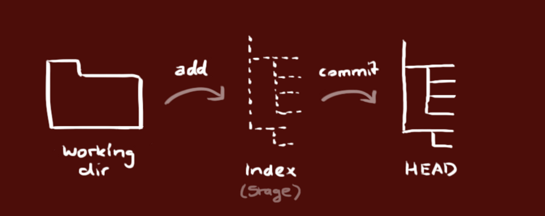
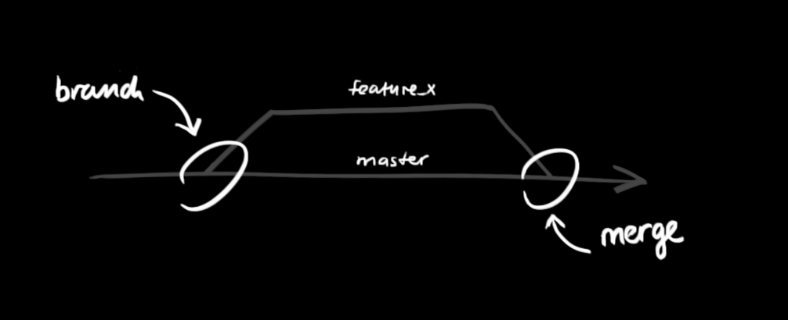

# Git Hints

A collection of hints I have have found to help me navigate Git

## Rollback changes and reset

`git fetch --all`

`git reset --hard origin/master`

Source: [http://stackoverflow.com/questions/1125968/force-git-to-overwrite-local-files-on-pull](http://stackoverflow.com/questions/1125968/force-git-to-overwrite-local-files-on-pull)

## Add Multiple files

`git add .`

To commit them:

`git commit -m "MY MESSAGE HERE" #-m is the message flag`

You can put those steps together like this:

`git commit -a -m "MY MESSAGE HERE"`

To push your committed changes from your local repository to your remote repository:

`git push origin master`

Source: [http://stackoverflow.com/questions/19576116/how-to-add-multiple-files-in-git-at-the-same-time](http://stackoverflow.com/questions/19576116/how-to-add-multiple-files-in-git-at-the-same-time)

## Create a branch after modifying files

If you have already modified files and your changes are larger than anticipated, you can create a branch after the fact by running the command:

`git checkout -b new_branch_name`

More info at StackOverflow question [Git: Create a branch from unstaged/uncommitted changes on master
](https://stackoverflow.com/questions/2569459/git-create-a-branch-from-unstaged-uncommitted-changes-on-master)

## Modify an existing commit

From document at GitLab about [keeping commit history clean](https://about.gitlab.com/2018/06/07/keeping-git-commit-history-clean/).

1. `git add <files>`
2. `git commit --amend`
3. Update the commit message if appropriate
4. `git push --force-with-lease <remote_name> <branch_name>`

# Roger Dudler hints

A series of great tips from [https://rogerdudler.github.io/git-guide/](https://rogerdudler.github.io/git-guide/) that I threw into MD
format

Content from:
[https://rogerdudler.github.io/git-guide/](https://rogerdudler.github.io/git-guide/)

## Setup

[Download git for OSX](http://code.google.com/p/git-osx-installer/downloads/list?can=3)

[Download git for Windows](http://msysgit.github.io/)

[Download git for Linux](http://git-scm.com/book/en/Getting-Started-Installing-Git)

## Create a New Repository

create a new directory, open it and perform a

`git init`

to create a new git repository.

## Checkout a Repository

create a working copy of a local repository by running the command

`git clone /path/to/repository`

when using a remote server, your command will be

`git clone username@host:/path/to/repository`

## Workflow

your local repository consists of three "trees" maintained by git. The first one is your Working Directory which holds the actual files. The second one is the Index which acts as a staging area and finally the HEAD which points to the last commit you've made.

## Add and Commit

You can propose changes (add it to the Index) using

`git add <filename>`

or for multiple files

`git add *`

or another for multiple files

`git add .`

This is the first step in the basic git workflow. To actually commit these changes use

`git commit -m "Commit message"`

Now the file is committed to the HEAD, but not in your remote repository yet.

## Pushing Changes

Your changes are now in the HEAD of your local working copy. To send those changes to your remote repository, execute

`git push origin master`

Change master to whatever branch you want to push your changes to.

If you have not cloned an existing repository and want to connect your repository to a remote server, you need to add it with

`git remote add origin <server>`

Now you are able to push your changes to the selected remote server

## Branching

Branches are used to develop features isolated from each other. The master branch is the "default" branch when you create a repository. Use other branches for development and merge them back to the master branch upon completion.

Create a new branch named "feature_x" and switch to it using

`git checkout -b feature_x`

switch back to master

`git checkout master`

and delete the branch again

`git branch -d feature_x`

a branch is not available to others unless you push the branch to your remote repository

`git push origin <branch>`

## Update and Merge

to update your local repository to the newest commit, execute

`git pull`

in your working directory to fetch and merge remote changes.

To merge another branch into your active branch (e.g. master), use

`git merge <branch>`

in both cases git tries to auto-merge changes. Unfortunately, this is not always possible and results in conflicts. You are responsible to merge those conflicts manually by editing the files shown by git. After changing, you need to mark them as merged with

`git add <filename>`

before merging changes, you can also preview them by using

`git diff <source_branch> <target_branch>`

## Tagging

It's recommended to create tags for software releases. this is a known concept, which also exists in SVN. You can create a new tag named 1.0.0by executing

`git tag 1.0.0 1b2e1d63ff`

the 1b2e1d63ff stands for the first 10 characters of the commit id you want to reference with your tag.

You can get the commit id by looking at the Git log

## Log

in its simplest form, you can study repository history using..

`git log`

You can add a lot of parameters to make the log look like what you want. To see only the commits of a certain author:

`git log --author=bob`

To see a very compressed log where each commit is one line:

`git log --pretty=oneline`

Or maybe you want to see an ASCII art tree of all the branches, decorated with the names of tags and branches:

`git log --graph --oneline --decorate --all`

See only which files have changed:

`git log --name-status`

These are just a few of the possible parameters you can use. For more, see `git log --help`

## Replace Local Changes

In case you did something wrong, which for sure never happens ;), you can replace local changes using the command

`git checkout -- <filename>`

This replaces the changes in your working tree with the last content in HEAD. Changes already added to the index, as well as new files, will be kept.

If you instead want to drop all your local changes and commits, fetch the latest history from the server and point your local master branch at it like this

`git fetch origin`

`git reset --hard origin/master`

## Useful Hints

built-in git GUI

`gitk`

use colorful git output

`git config color.ui true`

show log on just one line per commit

`git config format.pretty oneline`

use interactive adding

`git add -i`

# Links and Resources

## Graphical Clients

[GitX (L) (OSX, open source)](http://gitx.laullon.com/)

[Tower (OSX)](http://www.git-tower.com/)

[Source Tree (OSX & Windows, free)](http://www.sourcetreeapp.com/)

[GitHub for Mac (OSX, free)](http://mac.github.com/)

[GitBox (OSX, App Store)](https://itunes.apple.com/gb/app/gitbox/id403388357?mt=12)

## Guides

[Git Community Book](http://book.git-scm.com/)

[Pro Git](http://progit.org/book/)

[Think like a git](http://think-like-a-git.net/)

[GitHub Help](http://help.github.com/)

[A Visual Git Guide](http://marklodato.github.com/visual-git-guide/index-en.html)

From <https://rogerdudler.github.io/git-guide/>

[Keeping Git Commit History Clean](https://about.gitlab.com/2018/06/07/keeping-git-commit-history-clean/)
